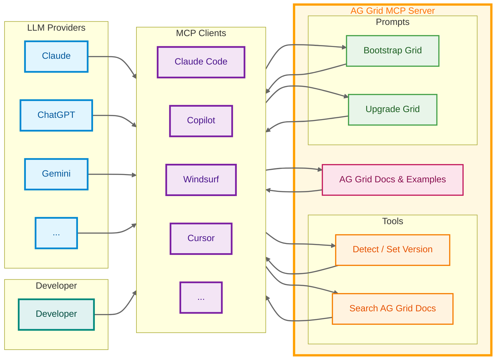

# AG Grid Model Context Protocol (MCP) Server

<div align="center">
    <a href="https://www.ag-grid.com?utm_source=ag-mcp-readme&utm_medium=repository&utm_campaign=github">
        <picture>
        <source media="(prefers-color-scheme: dark)" srcset="https://github.com/ag-grid/ag-grid/blob/latest/documentation/ag-grid-docs/public/images/ag-logos/svg-logos/AG-Grid-Logo_Dark-Theme.svg?raw=true"/>
        <source media="(prefers-color-scheme: light)" srcset="https://github.com/ag-grid/ag-grid/blob/latest/documentation/ag-grid-docs/public/images/ag-logos/svg-logos/AG-Grid-Logo_Light-Theme.svg?raw=true"/>
        
        </picture>
    </a>
    <!-- START MAIN DESCRIPTION -->
    <p>AG Grid's Model Context Protocol (MCP) server provides AI Agents with framework and version specific knowledge to help developers integrate and maintain their AG Grid code.</p>
    <!-- END MAIN DESCRIPTION -->
    <div align="center">
        <h4><a href="https://www.ag-grid.com?utm_source=ag-mcp-readme&utm_medium=repository&utm_campaign=github">🌐 Website</a> • <a href="https://www.ag-grid.com/javascript-data-grid/mcp-server/?utm_source=ag-mcp-readme&utm_medium=repository&utm_campaign=github">📖 Documentation</a> • <a href="https://www.ag-grid.com/community?utm_source=ag-mcp-readme&utm_medium=repository&utm_campaign=github">🏘️ Community</a></h4>
    </div>
    <br>
    
      
        
    <br><br>
</div>

## Overview

The `ag-mcp` server works with any LLM that supports MCPs, and provides tools to allow LLMS to lookup framework and version specific documentation, examples, and references to help create, modify, maintain, and upgrade your data grid code.

The core feature of the AG MCP Server is an LLM optimized search tool which will provide documentation, examples, API definitions and references. The content is provided in a condensed markdown so as to minimise the amount of context used, and not overwhelm the LLM.

AG-MCP also provides pre-built [prompts](#prompts) to simplify the process of [creating new grids](#quick-start), and [migrating to later versions](#migrations--upgrades).

### Architecture Diagram



## Installation

To install and use `ag-mcp` with your LLM client, provide the `npx ag-mcp` command in the normal process for adding an MCP Server.

### Cursor

[](https://cursor.com/en/install-mcp?name=ag-mcp&config=eyJjb21tYW5kIjoibnB4IGFnLW1jcCJ9)

To open Cursor and automatically add the `ag-mcp`, click the 'Add to Cursor' button.

To install manually, create a `mcp.json` file in the root of your project and add the following:

```json
{
  "mcpServers": {
    "ag-mcp": {
      "command": "npx",
      "args": ["ag-mcp"]
    }
  }
}
```

To learn more, see the [Cursor MCP documentation](https://cursor.com/docs/context/mcp)

### VS Code (Copilot)

[](vscode:mcp/install?%7B%22ag-mcp%22%3A%7B%22command%22%3A%22npx%22%2C%22args%22%3A%5B%22ag-mcp%22%5D%7D%7D)

To open Cursor and automatically add the `ag-mcp`, click the 'Add to Cursor' button.

To install manually, create a `.vscode/mcp.json` file in your workspace, and add the following:

```bash
"ag-mcp": {
    "type": "stdio",
    "command": "npx",
    "args": [
        "ag-mcp@{REPLACE-WITH-VERSION-NUMBER}",
        "${input:stdio-arg}"
    ],
    "env": {}
}
```

To learn more, see the [VS Code MCP documentation](https://code.visualstudio.com/docs/copilot/customization/mcp-servers).

### Claude Code

To add `ag-mcp` to Claude code, run the following command:

```bash
claude mcp add ag-mcp npx ag-mcp
```

To learn more, see the [Claude MCP documentation](https://docs.claude.com/en/docs/claude-code/mcp)

## Usage

Once the MCP is installed, your LLM will automatically take advantage of all the [Tools](#tools) and [Resources](#resources) available. Tools and Resources can also be accessed manually - refer to your LLM documentation for specific instructions.

### Prompts

Prompts are pre-configured actions that allow you to perform common actions, such as creating a new grid, or migrating to a later version.

- [`quick-start`](#quick-start) - Get started with AG-Grid in any framework
- [`upgrade_grid`](#migrations--upgrades) - Migrate to a newer version of AG-Grid

#### Quick Start

The `quick-start` prompt can be triggered directly from your LLM client. This creates a list of instructions for you LLM to follow when creating a new AG Grid project or adding AG Grid to an existing project.

You can pass additional context, requirements or instructions to your LLM as arguments to this prompt to fine tune the type of data grid you want the LLM to create.

#### Migrations & Upgrades

The `upgrade_grid` prompt creates a step by step plan to help migrate from your current version to the provided version. This is given to the LLM to execute, calling back to the MCP server as needed. It takes a version by version approach, making sure each version is correct before continuing.

### Config

Config, such as project roots and versions, is stored in your cache folder. For example, in MacOS it will be stored in `~/Library/Preferences/ag-mcp`.

## Resources (Docs, API & Example Search)

The core feature of the AG MCP Server is an LLM optimized search tool which will provide documentation, examples, and API definitions/interfaces. The content is provided in a condensed markdown so as to minimise the amount of context used, and not overwhelm the LLM.

There are currently three sets of resources available:

- `articles` - Access to the full AG Grid documentation at the correct version.
- `definitions` - API definitions and interfaces
- `examples` - A library of AG Grid implementation examples in you framework.

Your LLM can access these resources whenever it needs more information on how to implement AG Grid features. Refer to your LLM documentation for accessing these resources manually.

## Tools

Tools are schema-defined interfaces that enable AI models to perform actions. Each tool defines a specific operation with typed inputs and outputs, and the model automatically requests tool execution based on context.

Tools can be called manually by entering the tool name as a prompt into your LLM, and passing the relevant params. Refer to your LLM documentation for specific instructions.

AG-MCP currently provides four tools:

- [`search_docs`](#search-docs) - Search the documents for the currently installed version of AG Grid.
- [`detect_version`](#detect-verion) - Infers the version and framework of AG Grid installed in your repo.
- [`set_version`](#set-version) - Manually set the version of you repo (useful in monorepos).
- `list_versions` - List all available AG Grid versions from the API to see what versions are available for migration or reference.

### Search Docs

Search AG Grid documentation for the detected or latest version. Use this to find details on features, APIs, configurations, and troubleshooting. Supports natural language queries.

### Parameters

| Name      | Type   | Required | Description                                                                           |
| --------- | ------ | -------- | ------------------------------------------------------------------------------------- |
| query     | string | Yes      | Search term (e.g., `"column sorting"`, `"cell renderers"`, `"data grid performance"`) |
| version   | string | No       | Override the detected AG Grid version                                                 |
| framework | string | No       | Override the detected framework                                                       |

### Detect Version

Detect the AG Grid version and framework in the current project by analyzing package.json and dependencies. Use this to understand the project setup.

### Parameters

| Name | Type   | Required | Description                                                   |
| ---- | ------ | -------- | ------------------------------------------------------------- |
| path | string | No       | Path to the project directory (defaults to current workspace) |

### Set Version

Set the AG Grid version and framework to use for documentation searches and resources. Use this when working with a specific version or framework combination.

### Parameters

| Name      | Type   | Required | Description                                                               |
| --------- | ------ | -------- | ------------------------------------------------------------------------- |
| version   | string | Yes      | AG Grid version to use (e.g., `"34.1.0"`)                                 |
| framework | string | Yes      | Framework to use for documentation (`react`, `angular`, `vue`, `vanilla`) |
